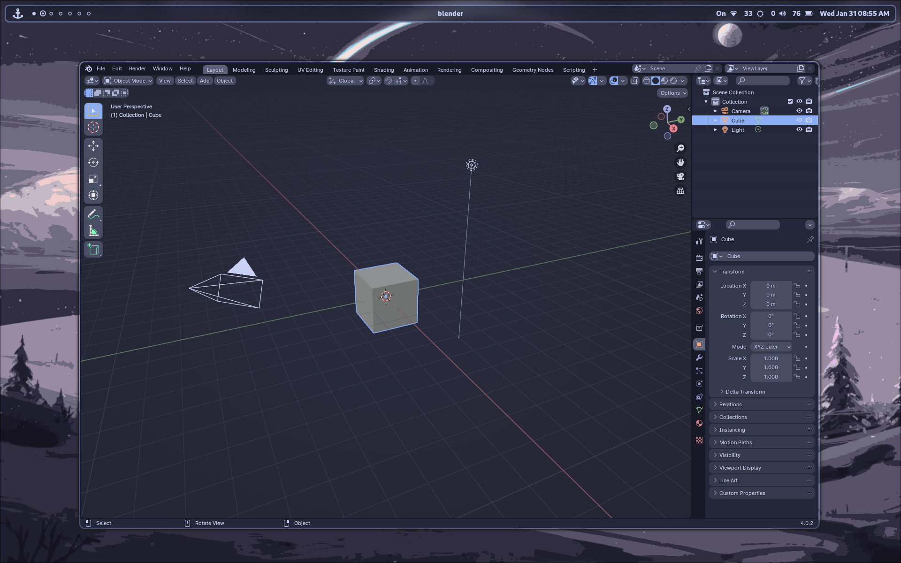

# Blender Notes - An Update! -Second update

## My Fake Blender Notes

### I am doing this to see how it works. Let's see.

[Jump to the Task List](https://github.com/Astonishskagen/g-notes/blob/main/blender.md#task-list)

Hello! Thank you for visiting my Blender Markdown notes. I am doing this to learn how to do markdown texts, but also to learn about creating a GitHub repository where I can sync all of my files.

[Link to the github cheatcodes](https://github.com/Astonishskagen/g-notes/blob/main/github.md)

---

### Things to learn here:

- Using markdown to create notes.
- Creating and managing a Github repository from the Linux terminal.
- Learning markdow sytax to make the nots **beautiful**.

### Things that I will _ignore_ in the **beginning**:

1. _Creating codes_ for applications.
2. Forking other repositories.
3. Learning coding.

### How should I add codes in this style?

Well, there are two ways of adding codes.

- If I have to add an inline code, I will use `this way`
- I didn't understand how to use block codes yet. I guess I found it:

```
{ #/bin/bash
echo "hello world!"
echo "This is my Fenced Code Block!"
exit
}
```

Apparently we can use **definitions** too. How to do that? Let's try:
Blender
: It is a beautiful application to 3D model.

Let's try adding an image with github link:


And one with a **relative link**:



### Task List

And also we can do **task lists** which can be very useful.

- [x] Practicing markdown syntax.
- [ ] Learn to create a Github repository.
- [ ] Learn to manage a Github repository.

Apparently we can use emojis too! :joy: :blue_heart: :sunglasses:

Also I fond out that I can ==hihlight important lines== **in markdown**.

> Warning!
> Remember that this is just the **beginning**.
> **Today** is 30/01/2024 and in **1 year** there will be much more stuff in this repo page.
> **Thank you** for following me!
